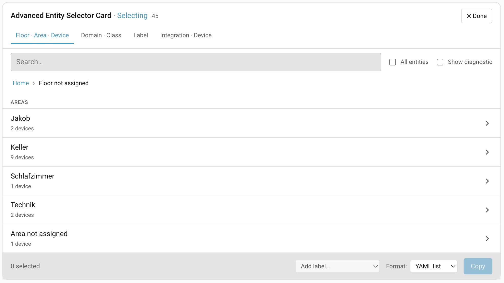

# Advanced Entity Selector Card

A fast, focused entity browser for Home Assistant dashboards. Pick the right entity — or a whole batch of them — without scrolling endlessly through the Developer Tools.



## What it does

Tag the entities you care about with one or more Home Assistant **labels**, then drop this card on a dashboard. The card shows only those entities, grouped the way you want, with everything you typically do next (copy IDs into YAML, search, tag in bulk) one click away.

- **Browse by structure, not by ID list.** Switch between *Floor · Area · Device*, *Domain · Class*, *Label*, or *Integration · Device* views over the same set of entities — no separate cards required.
- **Drill down with a breadcrumb.** Click a floor, then an area, then a device. Always know where you are.
- **Search across the working set** — by name, entity_id, area, floor, device, or label.
- **Copy entity IDs fast.** Single-tap copy per entity, or multi-select and bulk-copy as CSV, YAML list, or JSON array (great for dashboard YAML).
- **Quick-tag a multi-selection** with an existing Home Assistant label — much faster than tagging entities one by one in Settings.
- **Recents shortcut** remembers the entities you actually pick, scoped to each label set.
- **Visual config editor** — no YAML required for the common case.
- **Available in English and German**, auto-selected from your HA locale.

## When to use it

- You build dashboards and constantly need entity IDs for `entities:` / `entity:` blocks.
- You curate a working set ("important", "kitchen-relevant", "guest-mode") and want a fast way to inspect or bulk-tag them.
- You want a tidier alternative to the Developer Tools entity list for day-to-day use.

## Install via HACS

1. **HACS → 3-dot menu → Custom repositories.**
2. Add `enmacs/advanced-entity-selector-card`, category **Dashboard**.
3. Install, then add a resource if HACS doesn't do it automatically.
4. Tag a few entities with a Home Assistant label (Settings → Areas, labels & zones).
5. Add the card to a dashboard — either via the visual editor or YAML below.

## Minimal config

```yaml
type: custom:advanced-entity-selector
labels: [my-label]
```

## Full config

```yaml
type: custom:advanced-entity-selector
title: My Entities
labels: [my-label]
hierarchies:
  - floor_area_device
  - domain_class
  - label
  - integration_device
default_hierarchy: floor_area_device
show_state: true
show_diagnostic: false
recents_limit: 10
```

| Option | Type | Default | Description |
| --- | --- | --- | --- |
| `labels` | `string[]` | — (required) | HA labels to filter entities by. Only entities tagged with at least one of these are shown. |
| `title` | `string` | card name | Header shown at the top of the card. |
| `hierarchies` | `string[]` | all four | Which grouping views the user can switch between. |
| `default_hierarchy` | `string` | `floor_area_device` | Hierarchy selected on first load. |
| `show_state` | `boolean` | `true` | Show each entity's current state next to its name. |
| `show_diagnostic` | `boolean` | `false` | Default state of the "Show diagnostic" toggle. Diagnostic/config entities are hidden by default. |
| `recents_limit` | `number` | `10` | How many recently-picked entities to remember per label set (`0` disables). |

## Build (developers)

```shell
npm install
npm run build
```

Output: `dist/advanced-entity-selector-card.js`.

## Releasing a new version (maintainers)

HACS installs the bundle from the asset attached to each GitHub release, not from the repo (`dist/` is gitignored). To cut a release, run:

```shell
npm run release -- 0.3.1
# or directly:
./scripts/release.sh 0.3.1
```

The script:

1. Verifies you're on `main`, the tree is clean, the tag doesn't already exist, and you're not diverged from `origin/main`.
2. Bumps the version in `package.json` and `src/const.ts` (skipped if both already match), commits the bump.
3. Runs `npm run clean && npm run build` and checks the bundle contains the new version string.
4. Creates the `v<version>` tag, asks for confirmation, then pushes `main` + tag and runs `gh release create` with `dist/advanced-entity-selector-card.js` attached and auto-generated release notes.

Requirements: [`gh`](https://cli.github.com/) installed and authenticated (`gh auth login`). Pass `--yes` to skip confirmation prompts.

After the release lands, HACS picks it up on its next cache refresh (or trigger it manually from HACS → ⋮ → Reload data).

## License

MIT
